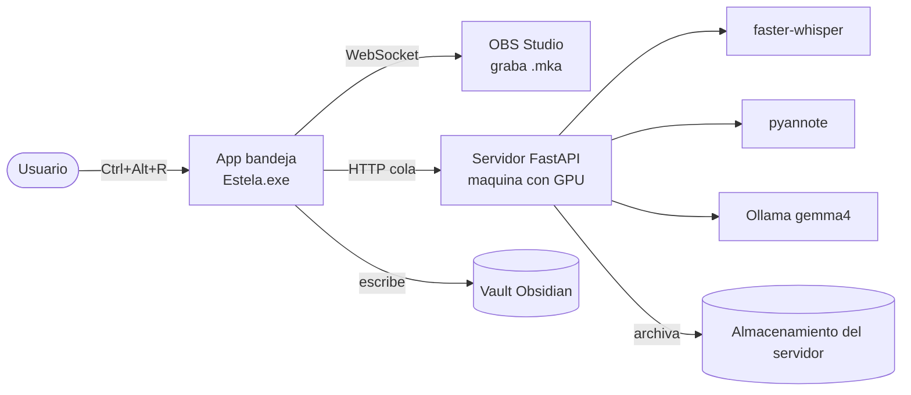

# Estela

> [!WARNING]
> **Proyecto deprecado desde el 2026-10-04.** No se usa ni se mantiene. El servidor
> desplegado (`actas-server.service` en la VM de GPU) se dio de baja, junto con el audio
> archivado y el cliente de bandeja. La version que corria en produccion corresponde al
> commit `acfa966` (ruta de audio `/mnt/actas/audio` via `ACTAS_AUDIO_DIR`, modelo de Ollama
> via `ACTAS_OLLAMA_MODEL` en `/etc/actas-server.env`). Para volver a desplegarlo, seguir las
> instrucciones de este README desde `main`.

[](https://github.com/ChristopherAedoP/estela/actions/workflows/ci.yml)

> Graba lo que se dice, déjalo grabado en piedra.

**Estela** es una herramienta personal de **grabación y transcripción de reuniones con
IA 100% local**. Graba el audio que suena en tu PC (reuniones, llamadas, videos), lo
procesa en una máquina con GPU y genera una **acta en markdown** con transcripción en
español, identificación de hablantes, resumen y tareas — guardada automáticamente en tu
vault de Obsidian.

Sin nube. Sin enviar tu audio a terceros. Todo corre en tu propia infraestructura.

## Qué hace

1. **Grabas** con un atajo global (`Ctrl+Alt+R`) — la app vive en la bandeja del sistema.
2. **Captura** el audio de la salida que elijas (vía OBS, sin cables virtuales).
3. **Transcribe** en español (faster-whisper large-v3).
4. **Identifica hablantes** (pyannote) → `[Hablante 1]`, `[Hablante 2]`…
   Requiere un token de Hugging Face y aceptar la licencia del modelo. Sin él, el resto
   del pipeline funciona igual, solo que sin separar hablantes.
5. **Resume** con un LLM local (gemma4:12b) → resumen, puntos clave, decisiones y tareas.
6. **Guarda** la nota en tu vault Obsidian y archiva el audio en el servidor.

Todo en **background**: grabas una reunión, se encola, y puedes grabar otra al instante.

## Qué plataformas soporta

Cliente y servidor son piezas separadas y no tienen el mismo soporte:

| | Windows | Linux | macOS |
|---|---|---|---|
| **Servidor** (transcribe) | Sí | Sí | No |
| **Cliente** (graba) | Sí | Parcial | Parcial |

**Grabar solo está resuelto en Windows.** La escena de OBS usa `wasapi_output_capture`,
que no existe fuera de Windows, y el atajo global tampoco está implementado en otras
plataformas. Desde Linux o macOS puedes usar el servidor, y grabar requiere adaptar la
escena de OBS a mano.

En macOS el servidor no es viable: las librerías de CUDA no publican versión para ese
sistema y el motor de transcripción no tiene aceleración por Metal. Lo práctico ahí es
apuntar a un servidor remoto.

## Arquitectura (resumen)



Detalle completo y diagramas C4 en [`docs/architecture.md`](docs/architecture.md).

## Componentes

| Parte | Tecnología | Ubicación |
|-------|-----------|-----------|
| **Cliente** | Python 3 + PySide6 (app de bandeja) | [`client-py/`](client-py/) → `Estela.exe` |
| **Servidor** | FastAPI + faster-whisper + pyannote + Ollama | [`server/`](server/) — en el mismo PC o en una máquina con GPU |
| **Despliegue** | Docker, o `deploy.ps1` para sincronizar código a un servidor ya provisionado | raíz |

> Nota: el identificador técnico interno del servicio sigue siendo `actas`
> (`actas-server`, paquete `actas`, variables `ACTAS_*`). "Estela" es el nombre del
> producto. Ver [`docs/decisions.md`](docs/decisions.md).

## Requisitos

- **GPU NVIDIA con CUDA 12.x** en la práctica. El servidor detecta el dispositivo: usa la
  GPU si la encuentra y cae a CPU si no. En CPU funciona, pero con `large-v3` una reunión
  larga tarda demasiado para ser útil.
- **Python 3.10 a 3.13**, [Ollama](https://ollama.com/download) y, en la máquina donde
  grabes, [OBS Studio](https://obsproject.com/).
- Alrededor de 15 GB de disco para los modelos, según el modelo que elijas.

Puedes correrlo **todo en un PC** o separar el cliente del servidor en dos máquinas.

## Quickstart

**Servidor con Docker** (lo más corto; requiere NVIDIA Container Toolkit):

```bash
docker compose up                 # servidor + Ollama
docker compose exec ollama ollama pull gemma4:12b-it-qat
curl "http://localhost:8770/health?deep=1"   # debe decir device: cuda
```

Comprueba ese último paso: si el contenedor no ve la GPU, el servidor **cae a CPU sin
avisar** y solo lo notarás por la lentitud. Ver
[`docs/troubleshooting.md`](docs/troubleshooting.md#el-contenedor-no-ve-la-gpu).

**Servidor sin Docker:**

```powershell
cd server
python -m venv .venv
.\.venv\Scripts\pip install torch==2.6.0 torchaudio==2.6.0 --index-url https://download.pytorch.org/whl/cu124
.\.venv\Scripts\pip install ".[gpu]"
ollama pull gemma4:12b-it-qat
```

**Cliente (Windows):**

```powershell
cd client-py
python -m venv .venv
.\.venv\Scripts\pip install -r requirements.txt -r requirements-dev.txt
pwsh -File build.ps1              # genera dist\Estela.exe
```

Ejecuta `Estela.exe`, abre **Ajustes** → apunta al servidor, elige el vault, la salida de
audio y la ganancia, y usa **Ctrl+Alt+R** para grabar.

Este resumen omite pasos que importan (OBS, token de Hugging Face para los hablantes, cómo
exportar el `.env`, cómo verificar que la GPU se ve). Para una puesta en marcha completa
sigue **[`docs/getting-started.md`](docs/getting-started.md)**.

## Documentación

- [`docs/getting-started.md`](docs/getting-started.md) — **Empieza aquí.** Puesta en marcha desde cero.
- [`docs/architecture.md`](docs/architecture.md) — Diagramas C4 + flujo.
- [`docs/configuration.md`](docs/configuration.md) — Variables del servidor, config del cliente, secretos.
- [`docs/server.md`](docs/server.md) — Pipeline, modelos, VRAM, deploy, tests.
- [`docs/client.md`](docs/client.md) — App de bandeja, OBS, ganancia, cola.
- [`docs/troubleshooting.md`](docs/troubleshooting.md) — Problemas resueltos y sus fixes.
- [`docs/decisions.md`](docs/decisions.md) — Decisiones técnicas (ADRs).
- [`docs/roadmap.md`](docs/roadmap.md) — Mejoras planificadas (usabilidad y funcionalidad).
- [`CHANGELOG.md`](CHANGELOG.md) — Historial de versiones.

## Stack

Python · PySide6 · OBS Studio (obs-websocket) · FastAPI · faster-whisper (large-v3) ·
pyannote.audio · Ollama (gemma4:12b) · CUDA 12.x · Docker · Obsidian

## Estado

**Funcional.** En uso. Proyecto personal de homelab.

## Licencia

[MIT](LICENSE). Se distribuye tal cual, sin garantía.

El audio y las actas que genera Estela **no salen de tu infraestructura**, pero eso depende
de cómo lo despliegues. Antes de compartir tu instalación o el repositorio, revisa qué
archivos contienen secretos en
[`docs/configuration.md`](docs/configuration.md#antes-de-compartir-el-repositorio).

Dos dependencias tienen licencia propia que debes aceptar por tu cuenta:
`pyannote/speaker-diarization-3.1` (requiere aceptar sus condiciones en Hugging Face) y el
modelo de Ollama que elijas para el resumen.
