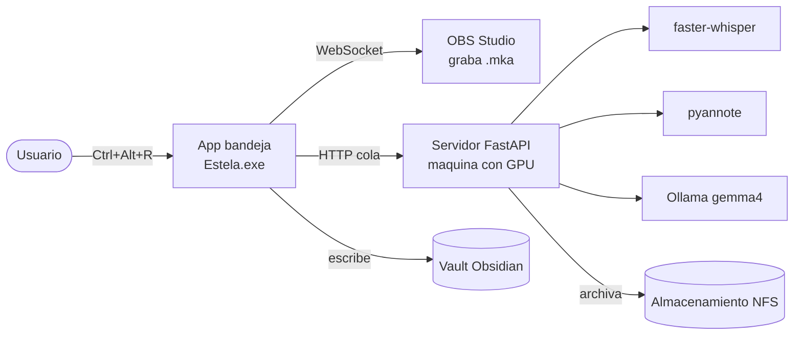

# Estela

> Graba lo que se dice, déjalo grabado en piedra.

**Estela** es una herramienta personal de **grabación y transcripción de reuniones con
IA 100% local**. Graba el audio que suena en tu PC (reuniones, llamadas, videos), lo
procesa en una máquina con GPU y genera una **acta en markdown** con transcripción en
español, identificación de hablantes, resumen y tareas — guardada automáticamente en tu
vault de Obsidian.

Sin nube. Sin enviar tu audio a terceros. Todo corre en tu propia infraestructura.

## Qué hace

1. **Grabas** con un atajo global (`Ctrl+Alt+R`) — la app vive en la bandeja del sistema.
2. **Captura** el audio de la salida que elijas (vía OBS, sin cables virtuales).
3. **Transcribe** en español (faster-whisper large-v3).
4. **Identifica hablantes** (pyannote) → `[Hablante 1]`, `[Hablante 2]`…
5. **Resume** con un LLM local (gemma4:12b) → resumen, puntos clave, decisiones y tareas.
6. **Guarda** la nota en tu vault Obsidian y archiva el audio en el servidor.

Todo en **background**: grabas una reunión, se encola, y puedes grabar otra al instante.

## Arquitectura (resumen)



Detalle completo y diagramas C4 en [`docs/architecture.md`](docs/architecture.md).

## Componentes

| Parte | Tecnología | Ubicación |
|-------|-----------|-----------|
| **Cliente** | Python 3 + PySide6 (app de bandeja) | [`client-py/`](client-py/) → `Estela.exe` |
| **Servidor** | FastAPI + faster-whisper + pyannote + Ollama | [`server/`](server/) → `/opt/actas-server` (VM 120) |
| **Despliegue** | `deploy.ps1` (scp a la VM) | raíz |

> Nota: el identificador técnico interno del servicio sigue siendo `actas`
> (`actas-server`, paquete `actas`, variables `ACTAS_*`). "Estela" es el nombre del
> producto. Ver [`docs/decisions.md`](docs/decisions.md).

## Quickstart

### Cliente (Windows)
```powershell
# Requisitos (una vez)
winget install OBSProject.OBSStudio AutoHotkey.AutoHotkey
# Compilar
cd client-py
python -m venv .venv
.\.venv\Scripts\pip install -r requirements.txt pyinstaller
pwsh -File build.ps1          # genera dist\Estela.exe
```
Ejecuta `Estela.exe`, abre **Ajustes** → elige la salida de audio a grabar y la ganancia,
y usa **Ctrl+Alt+R** para grabar.

### Servidor (VM 120)
```powershell
pwsh -File deploy.ps1         # sincroniza server/ -> /opt/actas-server
```
Ver [`docs/server.md`](docs/server.md) para la instalación completa (modelos, CUDA, systemd).

## Documentación

- [`docs/architecture.md`](docs/architecture.md) — Diagramas C4 + flujo.
- [`docs/server.md`](docs/server.md) — Pipeline, modelos, VRAM, deploy, tests.
- [`docs/client.md`](docs/client.md) — App de bandeja, OBS, ganancia, cola.
- [`docs/troubleshooting.md`](docs/troubleshooting.md) — Problemas resueltos y sus fixes.
- [`docs/decisions.md`](docs/decisions.md) — Decisiones técnicas (ADRs).
- [`CHANGELOG.md`](CHANGELOG.md) — Historial de versiones.

## Stack

Python · PySide6 · OBS Studio (obs-websocket) · FastAPI · faster-whisper (large-v3) ·
pyannote.audio · Ollama (gemma4:12b) · CUDA 12.x · Obsidian

## Estado

**Funcional.** En uso. Proyecto personal de homelab. Privado.
