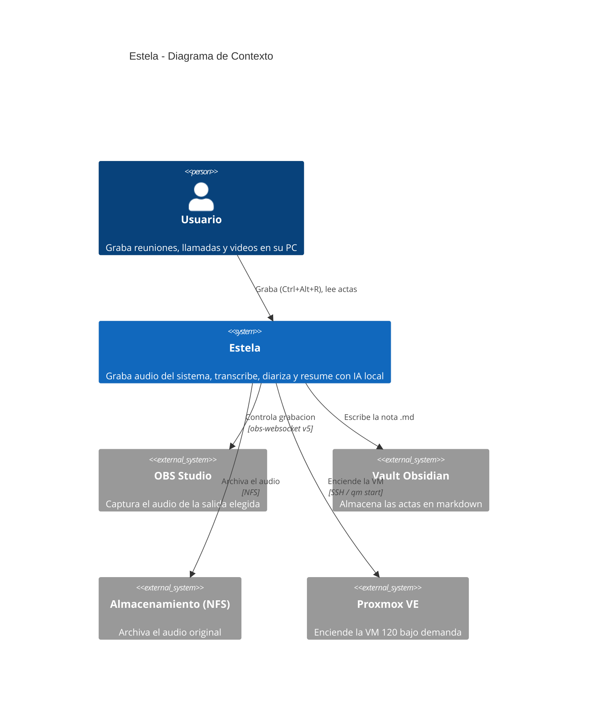
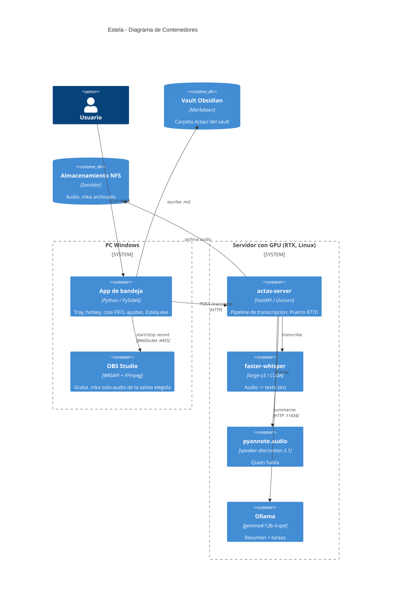
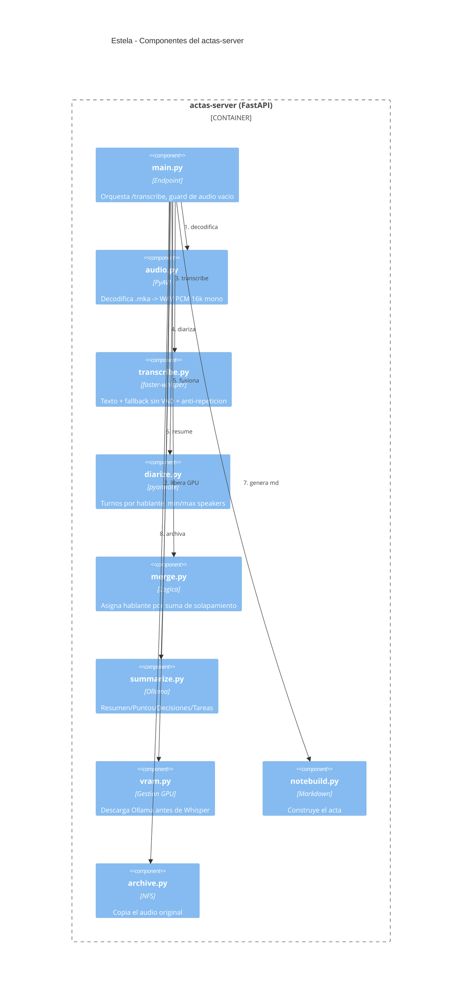
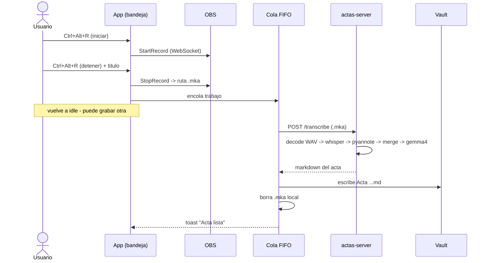

# Arquitectura — Estela

Arquitectura del sistema descrita con el modelo **C4** (Contexto → Contenedores →
Componentes) y un diagrama de secuencia del flujo principal. Diagramas en Mermaid.

## C4 — Nivel 1: Contexto

Visión general: quién usa Estela y con qué sistemas externos interactúa.

## C4 — Nivel 2: Contenedores

Las piezas ejecutables y dónde corren (PC Windows vs VM 120 con GPU).

## C4 — Nivel 3: Componentes (actas-server)

Módulos internos del servidor y el orden del pipeline.

## Flujo principal (secuencia)

De pulsar el atajo a tener el acta en el vault. Grabar y procesar están desacoplados:
tras detener, el trabajo se encola y la app queda libre para grabar otra.

## Decisiones clave de arquitectura

- **Cliente/servidor separados**: el PC graba (ligero); la VM con GPU procesa (pesado).
  El servidor solo se enciende bajo demanda (`onboot=0`).
- **Cola en background**: desacopla grabar de procesar; permite grabar varias seguidas.
- **Gestión de VRAM**: en la RTX 3060 (12 GB) el LLM y Whisper no caben juntos; se
  descarga Ollama antes de cargar Whisper.
- **OBS para captura**: evita VB-CABLE/cables virtuales; captura cualquier salida WASAPI.
- **El repo es la fuente de verdad**; la VM y el `.exe` son despliegues.

Ver razones detalladas en [decisions.md](decisions.md).
